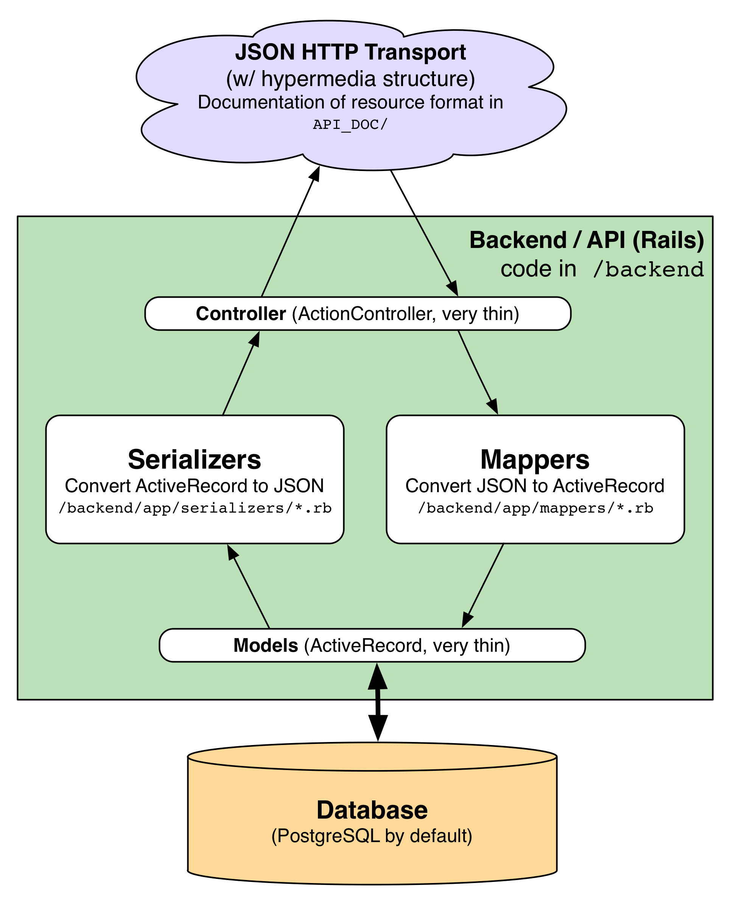

# The Xing Backend

Xing serves actual HTTP responses from a specialized Ruby on Rails application. We provide tools to be used with Rails in a ruby gem called *xing-backend*.

The Xing backend moves data in and out of a database and provides functionality that can't be done in the end-user's device, like authentication, authorization, integration with external APIs, and data processing.

## Architecture

*Serializers* convert database data to JSON format for transmission, and *Mappers* consume JSON data and make writes to the database. These are classes that live in ```backend/app```, parallel to Rails' models and controllers. 



In the diagram above, arrows show the direction of data flow: incoming JSON is passed through a Rails controller to a Mapper, which extracts the relevant information for one or more ActiveRecord objects. The ActiveRecord objects then save the information to the database. On read operations, the flow is reversed; models query the database and are passed to a Serializer, which is then rendered by the controller into JSON.  

Nearly all of the interesting logic in a Xing application happens in the Mapper and Serializer classes&mdash;generally the models and controllers are thin.
