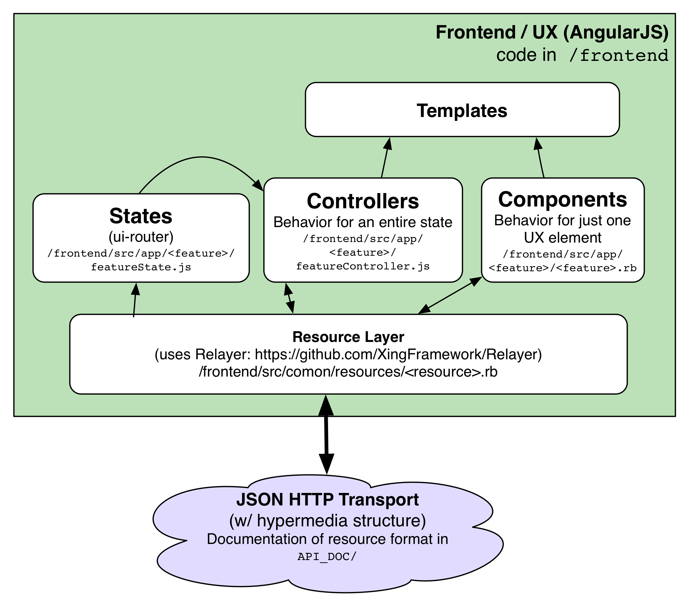

# The Xing Frontend

The Xing frontend provides all of the user experience&mdash;user interaction, templates, and styling. It's a fully fledged MVC application written in JavaScript that uses the JSON transport layer as its data source.

Xing incorporates an ES6 build process and includes ES-future decorators to speed the development process and improve code structure.

## Architecture

User navigation and application state is managed by [UI-Router states](https://github.com/angular-ui/ui-router), which map application functionality onto URLs. Each state is associated with a Controller, which renders a template.

Xing also supports a Components architecture, which is a derivative of AngularJS 1.X directives but which behaves as much as possible like Angular 2 Components. 

Both Components and Controllers load and save resources through the resource layer, which uses simple resource descriptors to interact with Xing hypermedia JSON resources.

## Technological Aspects of the Xing Frontend

The Xing frontend differs from classic AngularJS in a number of key ways:

### [Relayer](https://github.com/XingFramework/Relayer)

Xing provides a library called [Relayer](https://github.com/XingFramework/Relayer) to automate communication with the backend API server. Relayer provides implicit support of the Xing hypermedia JSON data format, making it trivial to talk to a Xing backend. 

To use Relayer, simply define the relational structure of the backend's JSON resources, and Relayer talks to the API for you. No need to worry about URLs, whether data is embedded or linked, or even how many API calls to make to get the information you want.

### ES6 / ESNext

Xing uses current generation JavaScript, and includes an integrated build environment with [Traceur](https://github.com/google/traceur-compiler) and [Grunt](https://gruntjs.io) to provide transpilation.

### [A1Atscript](https://github.com/hannahhoward/a1atscript)

Because Xing uses ES6, Xing can make use of TypeScript annotations.  Hannah Howard's module [A1Atscript](https://github.com/hannahhoward/a1atscript) provides an Angular 2-like syntax for annotating components, states, controllers and so forth.

### UI-Router

Xing uses [ui-router](https://github.com/angular-ui/ui-router), the best currently available router for AngularJS 1.x. 

### Modularization & File Architecture

Xing organizes front-end JavaScript files into subdirectories by feature, rather than by class type. For example, in a ToDo app with 'items', you would put the module, state, controller, and templates together in a single directory, as follows:

* /frontend/src/app/items/items.js   # module
* /frontend/src/app/items/itemsControllers.js
* /frontend/src/app/items/itemsStates.js
* /frontend/src/app/items/items-show.tpl.html
* /frontend/src/app/items/items-edit.tpl.html
