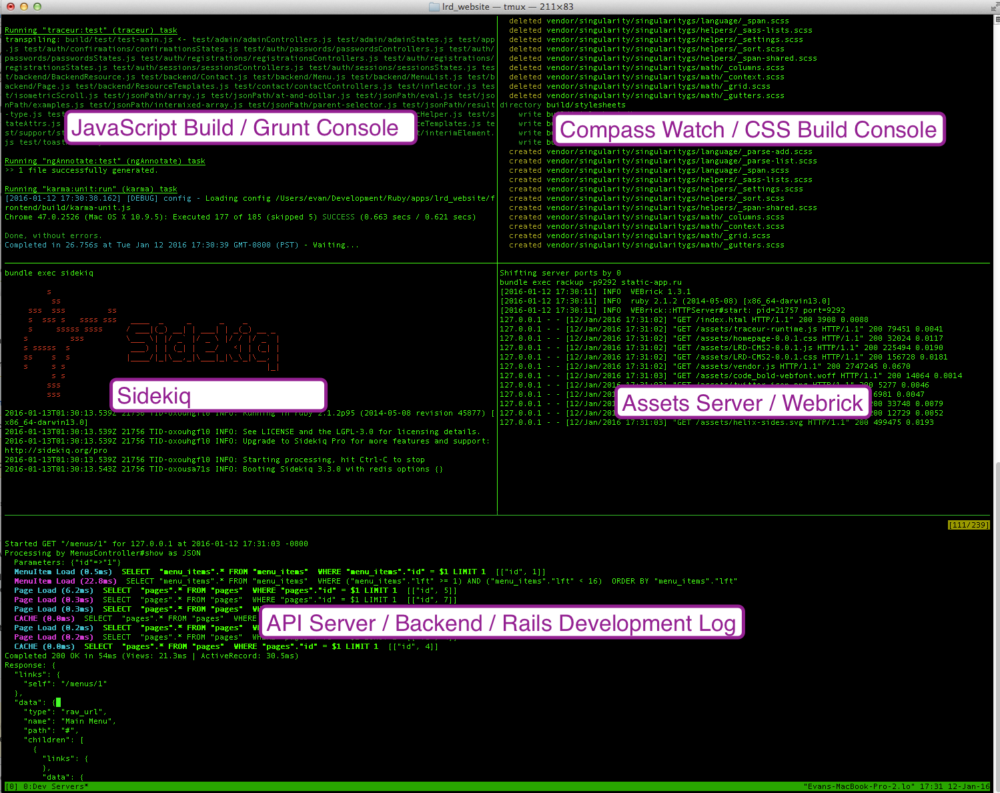

# Development Console

Launching and managing the many processes to work with an SPA in development can be a nightmare.  Xing reduces this to a single command with a unified developer's console.

## How Xing Manages Development

```rake develop```

Xing uses a set of rake tasks to manage the various processes involved in developing your application. ```rake develop```, run from the root of your Xing application, is the master command that will trigger the other tasks and start up all five processes.

```rake develop``` will also attempt to launch a clean instance of Google Chrome and navigate it to your application (which should be visible at localhost:9292 once all the processes are running and the frontend has compiled).

### tmux

It's highly recommended that you install tmux. If tmux is present on your system Xing will create a five-panel tmux window showing the server logs of all five processes.  If your terminal window is large enough to show all five panels at once, you'll see something like this:

## The Xing Developer's Console

Here's a screenshot of the Xing console in action, showing the logs of all five processes. We recommend that you spend a few minutes with the tmux help guides to learn to navigate between panes and pages, use scrollback features, and zoom panes to full screen.

