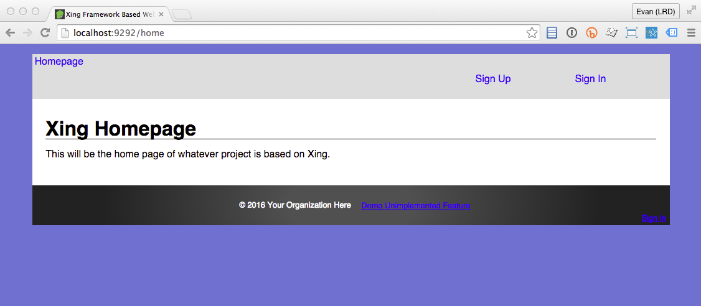

# Running The Application

## Migrate the database

After configuration, we will need to set up the database. While in the /backend dir:

    backend$ rake db:create
    backend$ rake db:migrate
    backend$ rake db:seed
    backend$ rake db:test:prepare

## Build and boot the app
    
Once your DB is created and migrated, you are ready to boot the application! Go back to the root directory and run ```rake develop```.

    backend$ cd ..
    backend$ rake develop
    
Five processes will start up: a Grunt JS build/watch, a compass CSS build/watch, a Webrick assets server, Rails, and a Sidekiq queue.  Two browser windows will launch: a Karma window (used by the JS build) and http://localhost:9292, the address of your assets server.  The latter should load index.html, which will pull in your compiled Javascript bundle and CSS.  (If it didn't open automatically just navigate any browser window to http://localhost:9292).  If everything worked, your terminal should look like this:


And your application should look like this:



If you see the above, congratulations: you have just built and run a complete combined AngularJS and Rails application stack!

If you seeded the database, you should be able to log in with the seed user: a complete authentication stack with proper token authentication is generated by default in a Xing application.  Click "Sign In" and enter the default user info: 'admin@xingframework.com' and 'password'.

## Closing the application

Your tmux developer console has five panels running five processes.  In tmux, you can close panels by typing ```<prefix> x```, which will prompt you for close. (The default prefix is CTRL-b). So ```CTRL-b x y <enter>``` five times will close your entire session.

That will get tedious in an hurry. So we recommend dropping a line like this one in the file ```~/.tmux.conf```.  This config will let you close your entire Xing console session with a single ```CTRL-b CTRL-x``` command:

    # ~/.tmux.conf
    bind-key C-x confirm-before -p "kill-session? (y/n)" kill-session
    
    