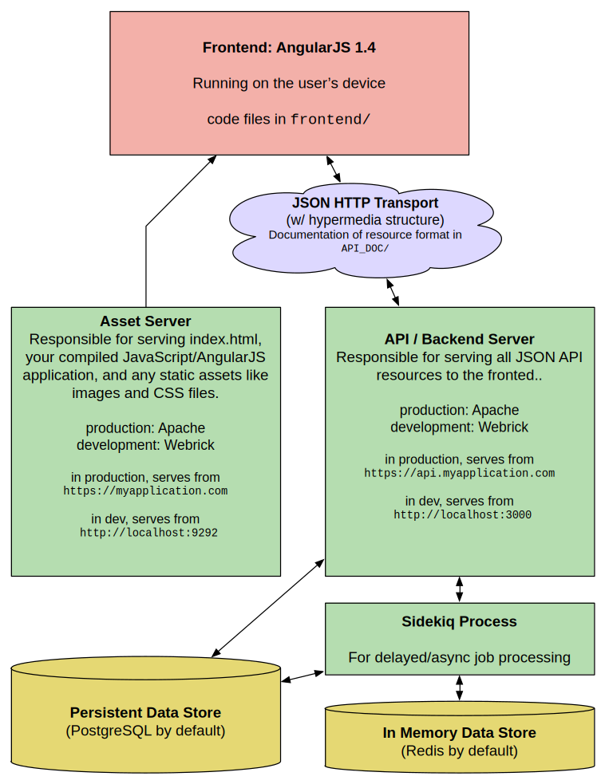
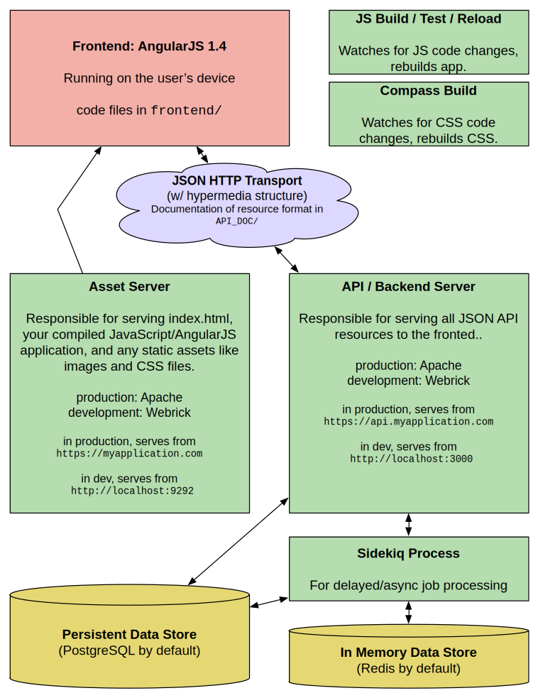

# Server Architecture

Serving a fully fledged SPA is a significant undertaking, and running such a thing in development mode is its own ball of wax. In production, three processes and two data storage engines need to be running. In development, five processes are necessary. Xing attempts to standardize this structure and give you development tools for managing it.  

## Production Architecture

The overall structure of a Xing application in production looks like this. Green rectangles represent processes that must be running on the server.

## Development Architecture

In development, two more processes will be running: a JavaScript build process, and a CSS/Compass build process. Both will watch your code for changes, rebuild the requisite assets, and reload your application in browser. The JavaScript build will also run your front-end Jasmine tests. 

